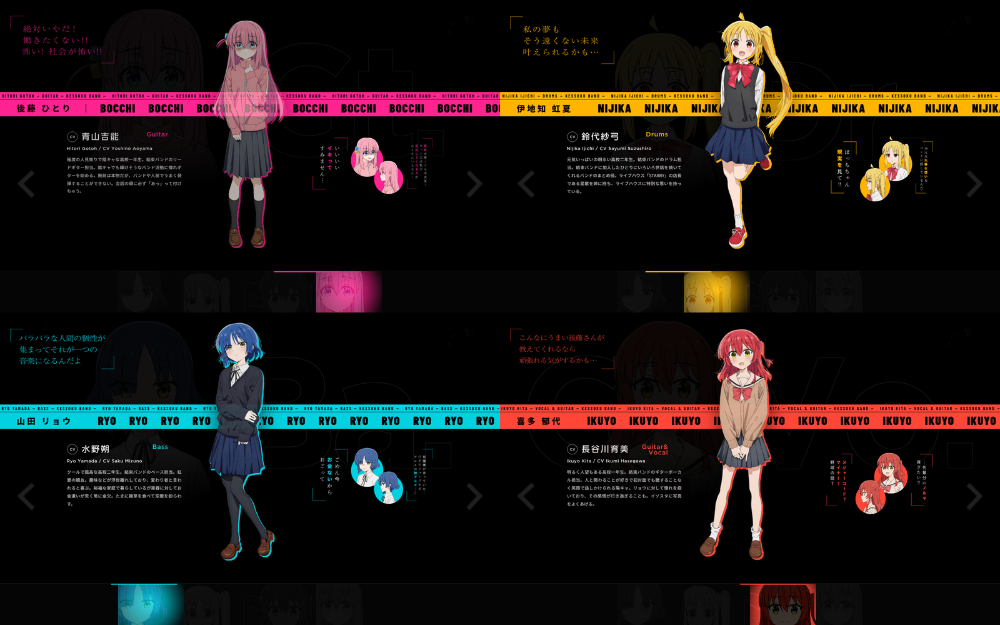
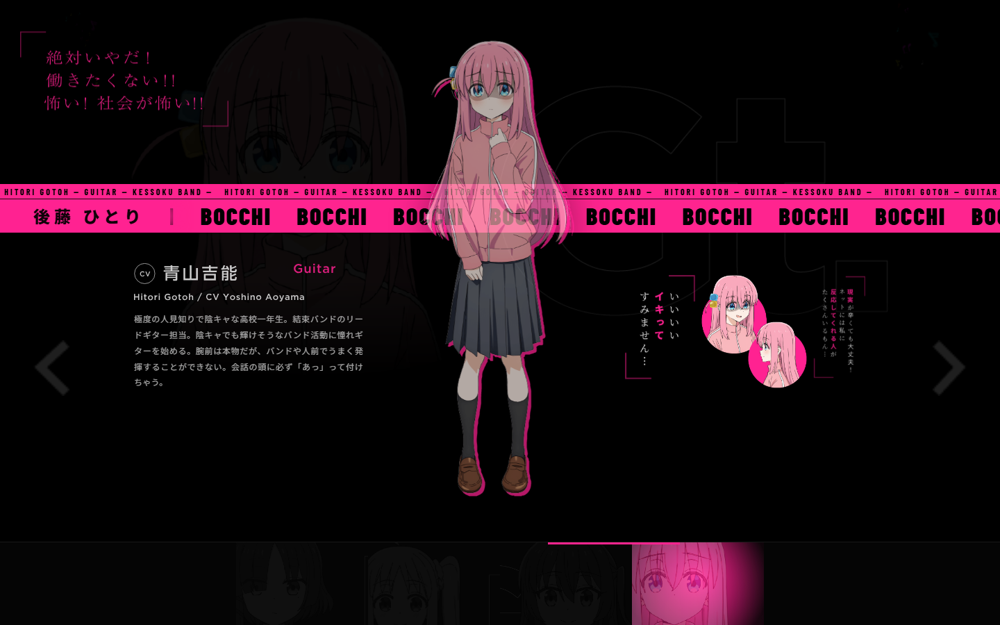
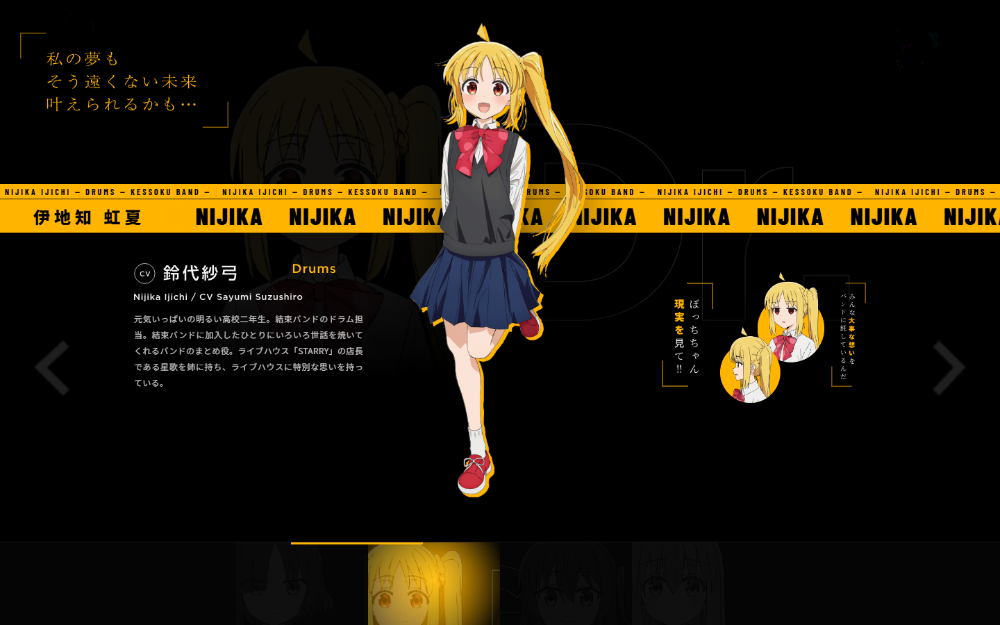
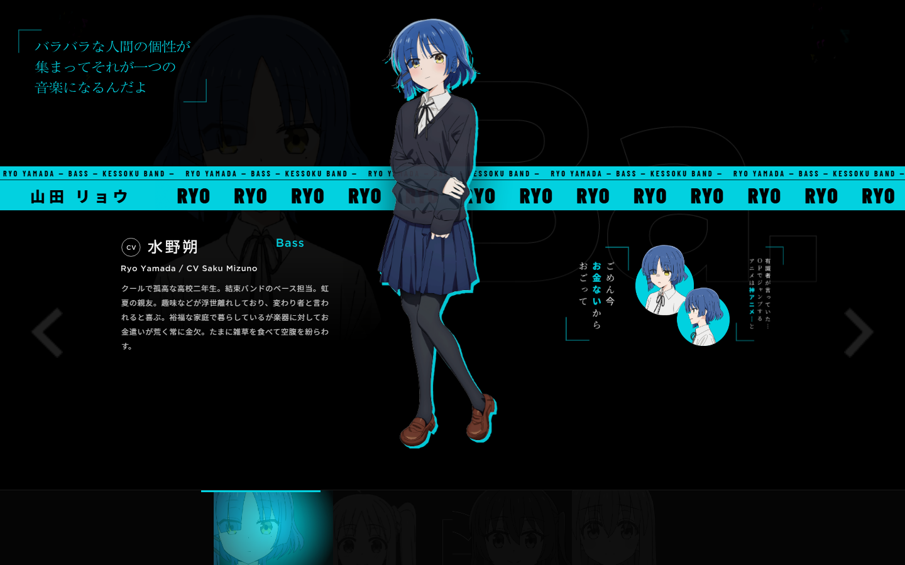
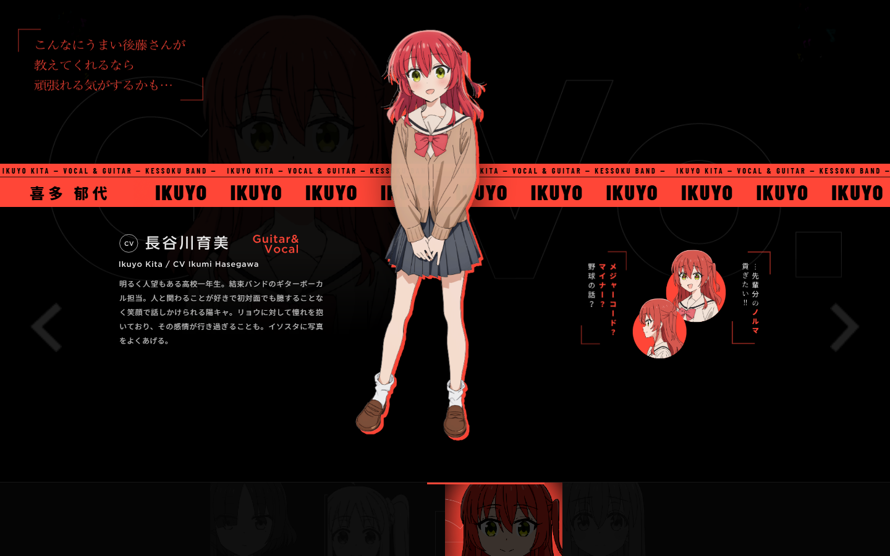

# bocchi the rock - slider animation

slider interactivo inspirado en kessoku band (*bocchi the rock!*), hecho con html, css, javascript y animaciones con gsap.



## capturas

| bocchi | nijika |
| :---: | :---: |
|  |  |
| hitori gotoh | nijika ijichi |

| ryo | ikuyo |
| :---: | :---: |
|  |  |
| ryo yamada | ikuyo kita |

## caracteristicas

- animaciones fluidas con gsap para los personajes, textos y citas.
- la interfaz cambia de color de fondo, resplandores y detalles segun el personaje activo.
- barra de marquee continuo con el nombre y rol de cada integrante.
- navegacion por arrastre (drag / swipe), clics en las miniaturas, botones laterales y teclas de flecha (<- y ->).
- autoplay con pausa al interactuar.

## como probarlo

no necesita dependencias ni instalacion previa:

```bash
git clone https://github.com/Miuted-wakeup/nightcute.git
cd nightcute
```

solo abre el archivo `index.html` directamente en el navegador.

## stack

- html5
- css3
- javascript
- gsap

---

inspirado en el trabajo de animecodeindo. recursos de bocchi the rock! (c) aki hamaji / houbunsha, aniplex.
